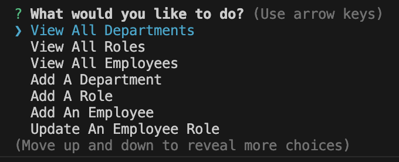
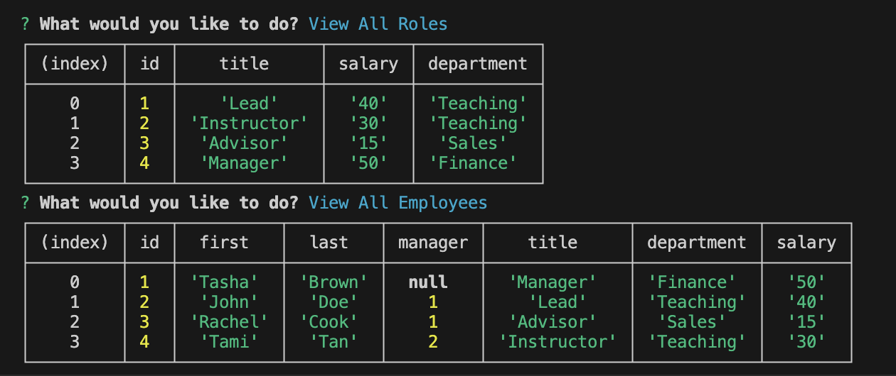

  
# Employee Tracker 
## Description 
  As a business owner, I want to be able to view and manage departments, roles, and employees in my company so that I can organize and plan my business.
## Table of Contents
[Installation](#installation) 

[Usage](#usage)

[License](#license)

[Credits](#credits)

[Tests](#tests)

[Questions](#questions)

## Installation 
  Clone repo, run npm init, then use the terminal to run npm install, to install packages.  Once packages are installed, then change folder to db and run mysql -u root.  Once in mysql, run source schema.sql.  Run source seeds.sql for dummy data.  Quit mysql and cd .. to return to root folder.  Then run the command node server.js to run the program.

## Usage 
  To run prompts, run the command node server.js and using the up and down arrows, select an option to view a table or to change employees' roles or to add/delete a department, for example.

Clone the repo here: 
https://github.com/marbfree/Employee-Tracker

Watch a tutorial here:
https://watch.screencastify.com/v/0EbI2RWUr1LomIA9vldo

## Credits 
  Thank you to the ASKBCS team, Tyler and Rudie, for your help in line 95 of server.js.  Thank you to my tutor, Benicio for guiding me to the next steps on how to attach the prompts to the tables.
## License
  mit
      [License](https://choosealicense.com/licenses/mit/)
      
## Tests 
  
## Questions
Check out my GitHub at https://github.com/marbfree 

